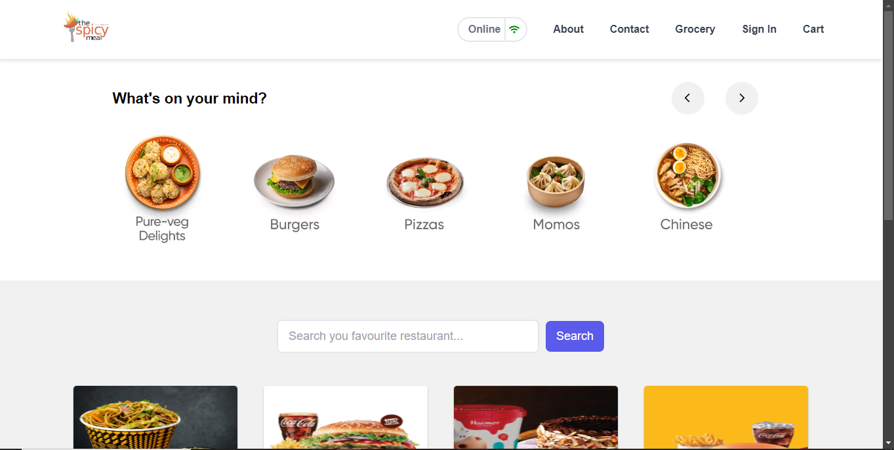
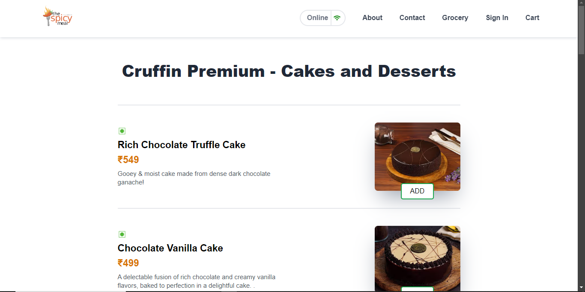
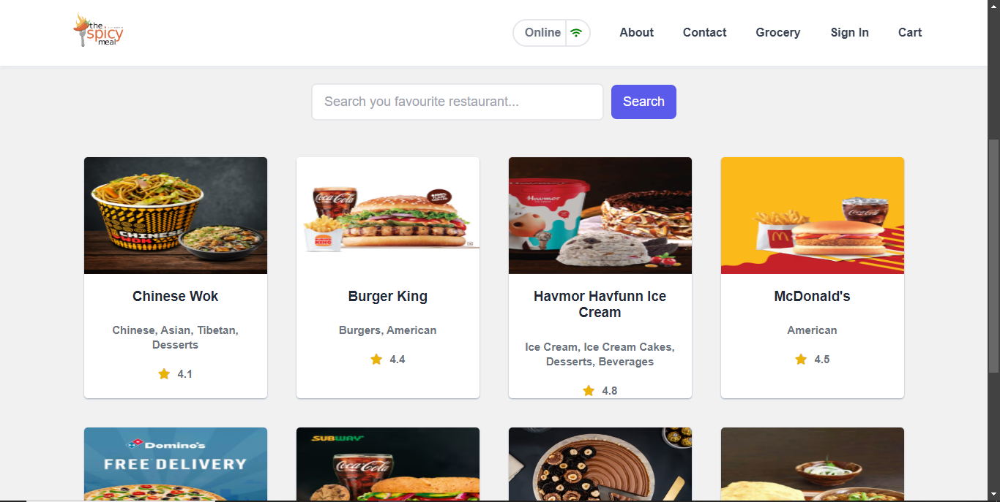

# The Spicy Meal 🍽️

Welcome to **The Spicy Meal**, your ultimate destination for ordering delicious meals online! This project was built to enhance my skills in React.js through a hands-on learning experience. Dive in to explore the tasty features and the tech stack behind it!

## 🚀 Live Demo
Check out the live website here: [thespicymeal.vercel.app](https://thespicymeal.vercel.app)

## 🎯 Purpose
**The Spicy Meal** was created as a project-based learning endeavor to master React.js. By building this online food ordering website, I explored various concepts and functionalities of React.js, gaining practical experience in web development.

## 🛠 Tech Stack
- **React.js**: A powerful JavaScript library for building user interfaces.
- **JSX**: A syntax extension for JavaScript, used with React to describe what the UI should look like.
- **Tailwind CSS**: A utility-first CSS framework for styling the application.
- **Live APIs**: Integration of real-time data to fetch and display the latest food items and deals.
- **Shimmer UI**: Used for a smooth user experience with visually appealing loading states.

## 🌟 Features
- **Real-Time Menu**: Browse through our dynamic menu with live updates.
- **Responsive Design**: Seamlessly accessible on all devices, thanks to Tailwind CSS.
- **Interactive UI**: Enjoy a smooth and engaging user experience with React.js.
- **Fast Loading**: Experience quick load times with efficient data fetching and React optimization.
- **Shimmer UI Effects**: Provides a smooth and visually appealing loading experience.

## ⚠️ CORS Policy
Due to the use of live APIs, you may encounter CORS policy issues when accessing the website. To resolve this, please install the CORS Chrome extension. Once installed, everything should work smoothly.

## 📸 Screenshots

---

Made with ❤️ by [Your Name]
